# Design: Agentic Task Queue

> Source: user-supplied feature specification
> Purpose: Structured work queue for agent execution — prevents session pollution,
> agent divergence, and token blowup during long execution cycles.

---

## Problem Statement

Long agent sessions accumulate context from multiple unrelated tasks, leading to
session pollution, divergent execution paths, and ballooning token usage. A
structured task queue isolates each unit of work: one task per agent session,
with a shared registry tracking state, dependencies, and provenance.

The queue is **shared across projects**: a single durable store holds tasks for
many repositories, and multiple independent agents claim and execute them —
triggered on a schedule (cron/routine) or by an event (push). This decomposes
into two layers (D10): a **dispatch layer** that stores tasks and hands each to
exactly one worker, and an **execution layer** (D4–D8) that runs a claimed task
in isolation and merges it back. All dispatch complexity — durability, atomic
claiming, cross-project targeting, distribution — lives in the dispatch layer;
the execution layer is unchanged whether one repo or many feed the queue.

---

## Decisions

### D1 — Registry: GitHub Issues as the shared store

The queue is backed by **GitHub Issues** in a dedicated queue repository (or a
GitHub Project spanning repos). Each task is one **issue**: the body carries the
self-contained task payload (context files, validation command, dependencies,
target repo), labels carry `status`, `priority`, and `project:<repo>`, and the
assignee is the worker that claimed it. Issue comments provide a free audit
trail.

GitHub Issues is chosen over a git-tracked `queue.json` because it solves the
**atomic-claim** problem (D12) that a shared JSON file cannot — concurrent
workers editing one file collide — and because it is durable beyond any
ephemeral container, reachable from every device (mobile included), and doubles
as the human interface for adding and reprioritizing tasks. See D10–D15 for the
full dispatch-layer design.

### D2 — Topological ordering

Tasks declare explicit `dependsOn` arrays (by task ID). The queue executor
never starts a task until all declared dependencies are `"completed"`. The
slicer that produces tasks is responsible for inferring these relationships
at ingest time — the executor is stateless with respect to ordering logic.

Among tasks that are all dependency-eligible, selection is **priority-tiered,
FIFO within a tier**. There are two tiers: `"high"` and `"default"`. Every
eligible `"high"` task is selected before any `"default"` task; within a tier,
insertion order breaks ties. The `dependsOn` gate still bounds everything — a
high-priority task does not run before its dependencies, regardless of tier.
Tiers are intentionally limited to two; arbitrary integer priorities are not in
v1.

### D3 — Dual ingestion paths

Manual ingestion (`/queue ingest`) runs an interactive alignment loop before
slicing. Automated ingestion (watchers, cron hooks) skips the alignment loop
and performs a context-collision check instead: if any file in the proposed
task's `contextFiles` is claimed by a pending manual task, the automated task
is dropped or deferred.

### D4 — Isolation model: worktree per task

Each task executes in its **own git worktree** on its **own branch**, cut from
the integration branch (see D6). The agent loads only the task's `contextFiles`;
no session state carries between tasks.

- **Success + validation passes:** commit on the task branch, merge that branch
  back into the integration branch, delete the worktree, mark `"completed"`.
- **Failure:** **delete the worktree** — nothing shared was touched, so there is
  no `git reset` to perform. Mark `"failed"`, write the trace to
  `result.outputLog`.

This replaces the original `git reset --hard` rollback. A shared working tree
forced serial execution and risked clobbering unrelated uncommitted work;
disposable worktrees give real isolation and make rollback a no-op (throw the
tree away).

### D5 — Skill home and harness targets

The `/queue` skill lives in the `system/agentic/queue-manager` namespace. It
ships as a scaffold skill following the standard harness format, emitted to
**all three harnesses — Claude, Cursor, and Antigravity** — via `hoist-skill`,
consistent with the rest of the scaffold skill set.

### D6 — Merge-back machinery: integration branch

The queue maintains a single **integration branch** — its running trunk. The
dependency relationship is realized through branch topology, not worktree
nesting (worktrees are flat checkouts sharing one object database; they do not
nest):

1. Each task branches off the integration tip into its own worktree.
2. On completion, the task branch merges back into integration.
3. A dependent task's worktree is cut from the integration tip **only after all
   its `dependsOn` branches have merged there.** So when task 4 (depends on
   1–3) begins, integration already contains 1, 2, and 3 — task 4 sees their
   work automatically, with no per-task octopus merge.

Two consequences:

- **Integration merges serialize even when execution parallelizes.** Tasks 1–3
  may *run* concurrently, but they merge into integration one at a time;
  conflicts between sibling tasks resolve at merge, sequentially. Merging is
  cheap relative to execution, so this is acceptable.
- **A dependent task sees everything merged before it, not strictly its
  declared deps.** For feature breakdown this is usually desired (work
  accumulates on the trunk). A strict "only my dependencies" base — cutting the
  task branch and merging exactly the parent branches — is possible when genuine
  isolation between unrelated tasks is required, at the cost of more merge
  machinery. Default is the integration model; strict mode is deferred.

### D7 — Merge-back conflict: agent-driven reconciliation task

Automatic conflict resolution is **not trusted**. A clean *textual* rebase can
still be *semantically* wrong, so the queue never silently auto-merges a
conflicted branch. Merge-back has exactly one cheap fast path; everything else
hands off to an agent.

1. **Attempt the merge** of the task branch into the integration tip, then run
   `validationScript`.
   - **Clean merge + validation passes →** record `result.mergeCommit`, delete
     the worktree, mark `"completed"`. This is the common, cheap case.
2. **Any merge conflict, or a clean merge whose validation then fails →** set the
   task `"reconciling"` and **enqueue a first-class reconciliation task**
   (`origin: "automated/reconcile/<taskId>"`, `priority: "high"` so it clears
   ahead of new default work).

The reconciliation task is itself a normal queued unit — agent-driven, isolated
worktree — but its job is integration, not re-implementation:

- It **starts from the existing task branch** (the worker's commits are
  preserved — no re-running the original task from scratch) and integrates it
  against the current integration tip with full context: the task spec, the
  branch diff, and the conflicting hunks or failing assertion.
- The agent merges **carefully**, applying judgment rather than trusting a
  mechanical rebase, and re-runs `validationScript`.
- **Success →** merge into integration; the original task transitions
  `reconciling → completed`.
- **Cannot produce a clean, validated merge →** the original task transitions
  `reconciling → failed` and is **held for later resolution** (human or a
  re-queued attempt). Failing safe is preferred over forcing a merge through.

The principle: preserve the worker's effort, never auto-merge on faith, and when
careful agent-driven integration still can't succeed, stop and surface it rather
than risk a bad merge.

### D8 — `run-all` failure policy: continue on independent work

A task failure does **not** halt the queue. The failed worktree is discarded and
the integration branch is untouched, so every remaining dependency-eligible task
still runs. Only the failed task's **transitive dependents** are skipped — their
base never landed — and they are reported in the run summary. This maximizes
throughput of an unattended drain; halting on first failure would strand ready
independent work.

### D9 — Automated ingestion is in scope for v1

Both ingestion paths ship in v1 (D3). Automated ingestion keeps the
context-collision check: a proposed automated task whose `contextFiles` overlap
a `pending` or `running` manual task's `contextFiles` is **deferred, re-evaluated
on the next watcher cycle**, and only dropped after a bounded number of deferrals
(configurable; default 3) to avoid an indefinitely starved automated task. Manual
work always wins the lock; automated maintenance yields.

---

## Dispatch Layer (shared, cross-project)

Architecture overview (source: [`architecture.mmd`](architecture.mmd)):



### D10 — Two-layer architecture

The system splits cleanly into a **dispatch layer** and an **execution layer**.
The dispatch layer owns the shared store, atomic claiming, cross-project
targeting, and distribution (push/cron). The execution layer (D4–D8) runs a
single claimed task in isolation and merges it back. The seam is a claimed task:
dispatch hands a worker one task; everything the worker does is execution-layer.
This keeps the hard concurrency problems in one place and leaves the per-repo
execution model identical whether one project or many feed the queue.

### D11 — Shared store: GitHub Issues / Project

Tasks live as GitHub Issues in a dedicated queue repo, optionally surfaced on a
GitHub Project board spanning repos (D1). Rationale: durable beyond ephemeral
containers, multi-device by construction (mobile GitHub app is a first-class
client), native atomic operations for claiming (D12), a built-in audit trail
(comments), and zero infrastructure to run. The tradeoff — polling latency and
API rate limits — is immaterial at personal, cross-project, human-paced scale.
If sub-second dispatch or high throughput is ever needed, the store graduates to
a hosted queue service without touching the execution layer.

### D12 — Atomic claim: assign + verify + lease

A worker claims a task by **assigning the issue to itself and flipping the
`status:running` label, then re-reading the issue to confirm it is the sole
assignee** (verify-after-write). If another worker won the race, the loser backs
off and picks the next eligible task. This is not a hard mutex, but the race
window is tiny and the cost of a rare double-claim is bounded (a second worker
discovers the task already `running` and yields).

Crash recovery uses a **lease**: a `running` task carries a heartbeat timestamp
the worker refreshes periodically. If the heartbeat goes stale (worker container
died — common in ephemeral environments), a sweep returns the task to `pending`
for another worker. Hard exclusivity is deferred; it would push the store toward
a hosted queue (D11) and is unnecessary at the starting concurrency.

### D13 — Distribution: cron and push, both GitHub-native

The same store serves both trigger models:

- **Cron / routine (pull):** a scheduled runner wakes, asks the store for the
  top eligible task (D2 ordering), claims it, and executes.
- **Push (event):** marking a task ready (an issue label/assignment event) fires
  a worker immediately, for near-zero dispatch latency.

Both read the same issues and use the same claim protocol (D12); push is an
optimization over cron, not a separate path.

### D14 — Worker substrate: phased rollout

- **Phase 1 (v1):** workers are **Claude routines and manual pulls** — a Claude
  session (scheduled via its loop/cron mechanism, or invoked by hand with
  `/queue next`) claims and executes a task in the current environment. No CI
  infrastructure required; fastest path to a working shared queue.
- **Phase 2 (later):** add **GitHub Action worker crons** — a scheduled/dispatched
  workflow runs Claude Code headless, so tasks drain unattended without an open
  session, and the push path (D13) becomes fully autonomous.

Phase 1 proves the dispatch + execution loop end to end with the least
machinery; Phase 2 removes the need for a live session. The store, claim
protocol, and execution layer are identical across phases — only the runner
changes.

### D15 — Cross-project targeting

Every task names its **target repository** (`project:<repo>` label + a `repo`
field in the body). A worker, on claiming, checks out that repo and runs the
execution layer there — the worktree, integration branch, and merge-back (D4–D8)
are all scoped to the target repo. One shared queue, many target repos; the
execution layer never sees the queue's cross-project nature.

---

## Canonical Vocabulary

| Term | Definition |
|------|------------|
| **task** | A single independent unit of work with its own context, command, and validation; stored as one GitHub issue |
| **queue store** | The GitHub Issues / Project holding all tasks across projects (D11) |
| **dispatch layer** | Shared store + claiming + targeting + distribution; hands each task to one worker (D10) |
| **execution layer** | Runs a claimed task in isolation and merges it back (D4–D8) |
| **worker** | An agent that claims and executes a task — a Claude routine/manual pull (Phase 1) or GitHub Action (Phase 2) |
| **claim** | Assign the issue to self + flip `status:running`, then verify sole assignee (D12) |
| **lease** | A heartbeat on a `running` task; a stale lease returns the task to `pending` (D12) |
| **target repo** | The repository a task operates on (`project:<repo>` label + `repo` field) (D15) |
| **slicer** | The ingest-time component that breaks a feature prompt into tasks and infers dependencies |
| **alignment loop** | The interactive Q&A phase during manual ingest that resolves design parameters |
| **integration branch** | The target repo's running trunk; completed task branches merge back into it |
| **task branch** | The per-task branch, cut from the integration tip and checked out in the task's worktree |
| **worktree** | A disposable git checkout (one per running task) sharing the target repo's object database |
| **merge-back** | Merging a completed task branch into the integration branch |
| **context collision** | Conflict when an automated task claims files already claimed by a pending manual task |
| **context lock** | Implicit claim on `contextFiles` held by a `pending` or `running` manual task |
| **origin** | How a task entered the queue: `"manual"` or `"automated/routine/<subtype>"` |
| **priority** | Selection tier: `"high"` (drained first) or `"default"`; FIFO within a tier |

---

## Task Schema

Each task is a GitHub issue. The payload below lives in the issue body;
`status`, `priority`, and `project` are mirrored as labels so the store is
queryable without parsing every body. `issue` and `assignee` are the issue
number and the claiming worker.

```json
{
  "id": "task-001",
  "issue": 42,
  "title": "Build native telemetry metrics interface",
  "status": "pending",
  "origin": "manual",
  "priority": "default",
  "repo": "victusfate/news-feed",
  "dependsOn": [],
  "contextFiles": ["src/telemetry/index.ts", "src/telemetry/types.ts"],
  "command": "npm test",
  "validationScript": "scripts/validate-telemetry.sh",
  "assignee": null,
  "leaseHeartbeat": null,
  "branch": null,
  "worktreePath": null,
  "deferrals": 0,
  "result": {
    "mergeCommit": null,
    "outputLog": null
  }
}
```

`repo` is the target repository (D15). `assignee` and `leaseHeartbeat` are set on
claim (D12): `assignee` is the worker that won the claim; `leaseHeartbeat` is the
timestamp refreshed while running, swept back to `pending` if it goes stale.
`branch` and `worktreePath` are populated when the worktree is created.
`result.mergeCommit` records the integration-branch commit from merge-back.
`deferrals` counts collision-check deferrals for automated tasks (D9); manual
tasks leave it at `0`. `priority` is `"high"` or `"default"` (default
`"default"`); see D2.

**Status transitions:**

```
proposed → pending → running → completed
 (human      (claim)         ↘ reconciling → completed | failed   (merge-back conflict, D7)
  selects)                    ↘ failed                             (task or validation failure)
```

`proposed` is the pre-approval state for assistant-recommended tasks (§3.3);
only a human selection promotes it to `pending`. `reconciling` is the state while
an agent-driven reconciliation task (D7) integrates the branch against the
integration tip; it resolves to `completed` (clean validated merge) or `failed`
(held for later resolution). A stale lease on a `running` task returns it to
`pending` (D12).

---

## Work Ingestion Lifecycle

```
[ Human Feature Prompt ]          [ Automated Background Monitors ]
          |                                       |
          v                                       v
/queue ingest "<msg>"              Watcher / cron / telemetry trigger
          |                                       |
          v                                       v
 Alignment Loop (Q&A)             Context Collision Check
          |                           |               |
          v                       no conflict      conflict
  Topological Slicer                  |               |
          |                      Silent insert      Drop / defer
          v                           |
 Create issues in queue store ←───────┘
```

Ingestion writes issues into the shared queue store (D11); it never runs them.
Adding tasks and draining them are separate — you can stack work mid-session and
leave it `pending` for a worker to pick up later.

### 3.1 Manual Ingestion (`/queue ingest`)

1. **Alignment loop** — query design parameters, storage backends, and
   verification metrics interactively. One question at a time until resolved.
2. **Topological slicing** — compile alignment results into independent
   execution units; infer chronological dependencies; assign `dependsOn` arrays.
3. **Queue insertion** — create issues with `origin: "manual"`,
   `status: "pending"`, and a `project:<repo>` label (D15).

### 3.2 Automated Ingestion

1. **Trigger** — file-watcher, telemetry monitor, or cron hook fires.
2. **Collision check** — compare proposed task's `contextFiles` against files
   claimed by any `pending` or `running` manual task. Drop or defer on conflict.
3. **Silent insertion** — non-conflicting tasks created as issues with
   `origin: "automated/routine/<subtype>"`, `status: "pending"`.

### 3.3 Recommended Ingestion (assistant proposals)

An external source (a personal-assistant library) may propose tasks. These enter
as issues with `status: "proposed"` and are **not** eligible for claim until a
human selects them — flipping `proposed → pending`. This is the human-in-the-loop
variant of automated ingestion: recommendations accumulate, you approve the ones
worth doing, and approval is what makes them runnable.

---

## Skill Interface (`/queue`)

### `/queue ingest "<prompt>"`

Enters the alignment loop. On completion, slices the work and creates one issue
per task in the shared queue store.

### `/queue next`

Queries the store for the next eligible task: `status == "pending"` and all
`dependsOn` entries `"completed"`. Among eligible tasks, every `"high"` priority
task is returned before any `"default"` task; within a tier, lowest insertion
order wins (D2). Returns that task block without claiming it.

### `/queue step <task_id>`

1. **Claim** the task (D12): assign the issue to this worker, flip
   `status:running`, verify sole assignee; on a lost race, back off and pick the
   next eligible task. Check out the task's `repo` (D15).
2. Cut a `task branch` from the integration tip and `git worktree add` a fresh
   worktree; record `branch` and `worktreePath`. Begin refreshing the lease
   heartbeat.
4. Load only the task's `contextFiles` — no other session state.
5. Apply code changes to satisfy the task requirements.
6. Run `command` then `validationScript`.
7. **Success (exit 0):** commit on the task branch, then merge-back per D6/D7:
   - Clean merge + passing validation → record `result.mergeCommit`, delete the
     worktree, set `status = "completed"`.
   - Merge conflict, or clean merge with failing validation → set
     `status = "reconciling"` and enqueue an agent-driven reconciliation task
     (D7). Never auto-merge a conflicted branch.
8. **Failure:** delete the worktree (no reset needed — the integration branch was
   never touched), set `status = "failed"`, write trace to `result.outputLog`.

### `/queue run-all`

Loop: `/queue next` → `/queue step`. On a task **failure, continue** with the
remaining dependency-eligible tasks — the failed worktree is discarded and the
integration branch is untouched, so independent work still runs (D8). The failed
task's **dependents are skipped** (their base never landed) and reported.
Terminate when no eligible task remains; emit:
`<queue_engine_state>TERMINATED_CLEANLY</queue_engine_state>`

---

## Resolved Decisions

All open questions from the prior revision are resolved:

| # | Question | Resolution | Encoded in |
|---|----------|------------|------------|
| OQ1 | Priority ordering | Two tiers (`high`/`default`); all eligible high tasks before any default, FIFO within a tier | D2 |
| OQ2 | Collision resolution for automated tasks | Defer and re-evaluate next watcher cycle; drop after N deferrals (default 3); manual work wins the lock | D9 |
| OQ3 | Harness target | Ship to all three: Claude, Cursor, Antigravity | D5 |
| OQ4 | `run-all` failure behavior | Continue with independent tasks; skip the failed task's transitive dependents | D8 |
| OQ5 | Merge-back conflict handling | No auto-merge; conflict (or post-merge validation failure) spawns an agent-driven reconciliation task that preserves existing commits, or fails safe for later resolution | D7 |
| OQ6 | Shared store across projects | GitHub Issues / Project as the queue; two-layer dispatch/execution split | D1, D10–D11 |
| OQ7 | Atomic claim across workers | Assign + verify-after-write + lease heartbeat; hard exclusivity deferred | D12 |
| OQ8 | Distribution model | Cron/routine and push, both GitHub-native, same claim protocol | D13 |
| OQ9 | Worker substrate | Phased: Phase 1 Claude routines + manual pulls; Phase 2 GitHub Action crons | D14 |

## Remaining Implementation Notes

These are sequencing details for the plan phase, not open design questions:

- **Concurrency cap** — how many workers/worktrees run in parallel. A simple fixed
  cap is fine for v1; tune later.
- **Lease timeout tuning** (D12) — heartbeat interval and staleness threshold;
  pick values once real task durations are known.
- **Reconciliation worker context** — exact payload handed to the D7
  reconciliation step (diff format, how the failing assertion is surfaced).
- **Queue repo layout** (D11) — one queue repo vs. a GitHub Project spanning
  repos; label taxonomy for `status`/`priority`/`project`.
- **Strict "only my deps" base** (D6) — deferred; default integration model
  ships in v1.
