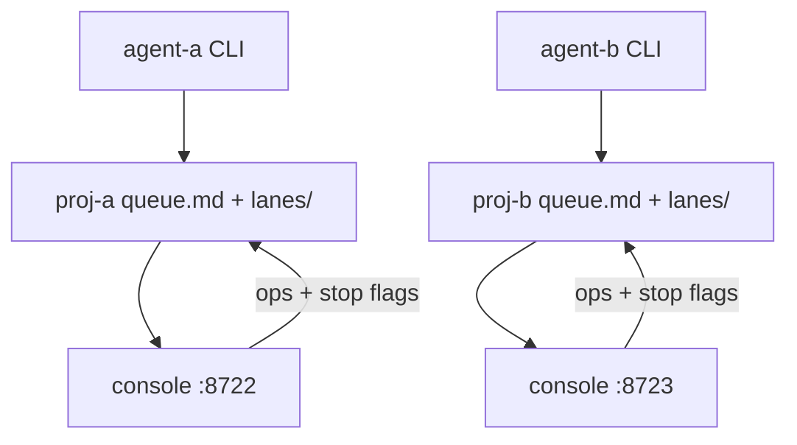

# Design: Multi-Queue Board (isolated consoles — YAGNI pivot)

> Pivot: the operator rarely views two repos at once. The federated
> single-board design (D2, D4, D5, D7, D8 below, marked SUPERSEDED) is
> dropped. Each repo gets its own console — which works today via
> `QUEUE_FILE` + distinct ports. The remaining build is a two-console
> runbook plus, conditionally, repo-namespaced worktrees (D6).

## Canonical Vocabulary
| Term | Definition |
|------|-----------|
| Queue | One project's `queue.md` file plus its sidecars (`.lock`, `log.md`, `archive.md`, `lanes/`). Independent unit of ownership. |
| Console | One repo's board: `node scripts/queue-console.ts --port <n>` with `QUEUE_FILE` pointing at that repo's `queue.md`. |
| Repo | A project owning one queue; its identity namespaces worktree branches (`queue/<repo>-<id>`) when checkouts are shared. |
| Lane | One claimed task's live execution record (heartbeat sidecar), owned by its worker, namespaced under its queue. |
| Heartbeat | A lane sidecar write (`step`, `tail`, `updatedAt`); liveness signal only. |
| Stop-request | A cooperative per-lane flag file; the owner honors it, nobody kills. |

## Decisions
### D10 — Isolation proven by test, not by live agents (confirmed)
**Decision:** A test spins up two consoles on isolated ports with distinct `QUEUE_FILE`s and asserts independence: ops on A never touch B's file, locks/sidecars/lanes stay per-dir, both bind loopback-only. No live two-agent run needed.
**Rationale:** Ports + files are the isolation boundary; proving it in a test is deterministic and repeatable.
### D9 — Isolated consoles, one per repo (YAGNI pivot, confirmed)
**Decision:** No federated board. Each repo runs its own console on its own port; the operator keeps one tab per repo and looks at one at a time. Multi-view is N tabs, not one page.
**Rationale:** Matches actual usage (simultaneous two-repo view is rare); zero new server code; every feed-up/feed-down mechanism already works per-console unchanged.
**Alternatives considered:** Federated board (D2/D4/D5/D7/D8) — rejected as over-engineering for a rare need.

### D3 — Feed-down is file writes (kept, per-console)
**Decision:** The console never pushes into an agent process. Steering gestures become validated ops on that repo's `queue.md` under its lock, or cooperative `lanes/<id>.stop` flags. Agents re-read every tick; their Monitor polls their own `signal`/`DRAIN-WANTED`; owners honor stop flags at safe points.
**Rationale:** Session isolation holds; the file stays the single contract in both directions.
**Alternatives considered:** Direct HTTP push or process signaling — rejected.

### D1 — Files stay source of truth, no central broker (kept)
**Decision:** Each project's `queue.md` is its own source of truth; agents use their local CLI. No Redis/broker.
**Rationale:** Human-editable, git-durable, zero-dependency, offline.

### D6 — Repo-namespaced worktrees/branches (conditional)
**Decision:** If the two test repos share one checkout, branch becomes `queue/<repo>-<id>` and worktree paths anchor per repo. With separate checkouts per repo, this drops out entirely.
**Rationale:** Same `task-001` fanned out from one checkout collides textually and on disk; separate checkouts never share the namespace.
**Status:** Open — depends on the test setup (see Q&A).

## Superseded (federated board — NOT building)
- D2 dynamic `POST /api/register` — superseded by D9 (no registry; `QUEUE_FILE` + port per console).
- D4 dormant tray — superseded (a quiet repo is just its tab idle; existing `stale` lane grey covers dead lanes).
- D5 repo chips/colors — superseded (one repo per page needs no tag axis).
- D7 extend-console-plus-registry — superseded (no registry module; console unchanged).
- D8 goodbye/heartbeat presence, no websockets — superseded (no presence channel; process lifetime is outside the console).

## Visualizations

### Isolated consoles topology

## Edge Cases & Scenarios
- Scenario: agent-a writes while its console edits proj-a → per-file lock serializes; proj-b unaffected → expected behavior: consoles are independent.
- Scenario: operator stops agent-a → its tab goes idle (stale lanes grey); proj-b tab unaffected → expected behavior: termination is visible as idleness, no presence protocol needed.

## Q&A Summary
**Q:** Source of truth — federated files or central store?
**A:** Federated files. Confirmed, kept.
**Q:** Registration — static env, discovery, or POST API?
**A:** POST API confirmed, then SUPERSEDED by D9 — no registry at all.
**Q:** Dormant tasks — hide or show?
**A:** Collapse-tray confirmed, then SUPERSEDED by D9 — idle tabs need no tray.
**Q:** Repo colors — auto-assign?
**A:** Auto-assign with distinctness + readability confirmed, then SUPERSEDED by D9.
**Q:** Worktree collision fix in scope?
**A:** In scope conditionally (D6) — only if test repos share a checkout.
**Q:** Callable home — extend in place?
**A:** Extend confirmed, then SUPERSEDED by D9 — console unchanged.
**Q:** Registration liveness / websockets?
**A:** Goodbye + heartbeat, no websockets — then SUPERSEDED by D9.
**Q:** Simplify to isolated consoles per repo?
**A:** Yes — YAGNI pivot (D9).
