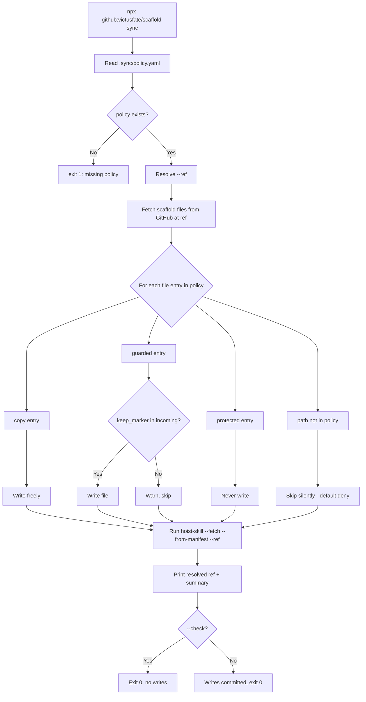

# Design: npx Zero-Local-Code Consumer Sync

## Canonical Vocabulary

| Term | Definition |
|------|-----------|
| consumer | A downstream repo that pulls from scaffold (e.g. `victusama`). Owns no sync logic — only data (policy + manifest). |
| policy file | `.sync/policy.yaml` — consumer-owned, hand-authored config declaring which scaffold files may be copied, guarded, or protected. |
| skill manifest | `.sync/hoisted` — tab-separated file written by `hoist-skill`, listing emitted skill entries. Tool-written, not hand-authored. |
| copy | Policy rule: scaffold file is always freely overwritten on sync. |
| guarded | Policy rule: scaffold file is overwritten only when the incoming content still contains a `keep_marker` string; otherwise left untouched. |
| protected | Policy rule: file is never written under any flag, including `--force`. |
| default deny | Any path not listed in policy is never written, silently skipped. |
| keep_marker | A string that must appear in the incoming scaffold file for a `guarded` entry to be promoted. Absence means scaffold removed the import → do not clobber local file. |
| `--check` | Dry-run mode: prints exactly what would change, exits without writing anything. |
| `--ref` | Git ref (tag, commit, branch) passed to hoist-skill and used to fetch scaffold content from a pinned version. |
| sync tool | The new `bin/sync` command, runnable via `npx github:victusfate/scaffold` (and optionally a named npm package). |
| hoisting | The existing `hoist-skill` operation: fetching and emitting skills from scaffold into a consumer repo. |
| provenance | The resolved ref the sync tool actually acted on, printed to stdout. |

---

## Decisions

### D1 — Guarded-file semantics are consumer-declared, not hardcoded

**Decision:** The policy file (`.sync/policy.yaml`) lives in the consumer repo and declares which files are `copy`, `guarded`, or `protected`. The sync tool is a pure function of that policy; scaffold has no hardcoded knowledge of consumer-owned files like `CLAUDE.md` or `MIND.md`.

**Rationale:** The original objection to scaffold's push installer was loss of consumer control. Keeping protection rules as consumer-owned data preserves that control while removing the consumer's need to maintain sync scripts.

**Alternatives considered:** Hardcoding `CLAUDE.md` guard in the tool — rejected because it encodes consumer-specific knowledge in scaffold.

---

### D2 — Default deny

**Decision:** Any path not listed in the policy is never written. No implicit fallback.

**Rationale:** Fail-safe; prevents scaffold from accidentally promoting new files the consumer never opted into.

**Alternatives considered:** Default allow with an opt-out blocklist — rejected because it reintroduces the "blank check" failure mode.

---

### D3 — `protected` is absolute

**Decision:** A `protected` path is never written under any flag, including `--force`.

**Rationale:** `protected` exists precisely to encode consumer-critical files that must never be clobbered by a flag typo or an automated invocation.

---

### D4 — Fail-safe guard semantics

**Decision:** A `guarded` file is written only when the incoming scaffold file contains the `keep_marker` string. If absent, the local file is left untouched and a warning is printed. Never silently clobber.

**Rationale:** `CLAUDE.md`'s `@MIND.md` import is the canonical example. If scaffold's `CLAUDE.md` stops importing `@MIND.md`, the consumer wants to know, not silently lose the import.

---

### D5 — `--check` dry run

**Decision:** `--check` prints a diff-style summary of what would be written, skipped, or warned, then exits 0 without writing any file.

**Rationale:** Lets consumers preview a sync before committing, and CI can validate what _would_ change.

---

### D6 — Separate policy file vs. skill manifest

**Decision:** `.sync/policy.yaml` (files section, hand-authored by consumer) remains separate from `.sync/hoisted` (skills manifest, written by hoist-skill). The policy file holds a `skills.manifest` pointer to `.sync/hoisted` but does not inline skill entries.

**Rationale:** The tool writes `hoisted`; the human writes `policy.yaml`. Mixing them creates merge conflicts and breaks the tool's ability to overwrite the manifest freely.

---

### D7 — Pinning and provenance

**Decision:** `sync` accepts `--ref <tag|sha|branch>` (default: `main`). The resolved ref is printed to stdout before any file is written. Consumers pin a tag for reproducibility.

**Rationale:** `npx github:victusfate/scaffold#v1.2` pins the tool version; `--ref v1.2` pins the content version. Both are independent and both are needed.

---

## Proposed Policy File Schema

```yaml
# .sync/policy.yaml  (consumer-owned, committed)
ref: main                         # default ref; overridden by --ref flag
files:
  copy:                           # freely overwritten
    - AGENTS.md
    - docs/agent-authoring-requirements.md
  guarded:                        # overwrite only when incoming file satisfies keep_marker
    - path: CLAUDE.md
      keep_marker: "@MIND.md"
  protected:                      # never written, even with --force
    - MIND.md
skills:
  manifest: .sync/hoisted         # reuse existing registration manifest
```

---

## Proposed Invocation

```bash
# No npm publish required (installs from GitHub directly):
npx github:victusfate/scaffold sync --into . --ref v1.2

# Named package form (version-pinnable, smaller download):
npx @victusfate/scaffold-sync@1.2 sync --into . --ref v1.2
```

---

## Callable Unit

**Command:** `sync` (exposed via `bin/sync` in scaffold)

**Home:** `bin/` — it is a consumer-facing CLI, not an agent tool or internal script.

**Invocation:** `npx github:victusfate/scaffold sync [options]`

**Inputs:**
- `--into <path>` — destination root (default: `.`)
- `--ref <ref>` — scaffold git ref for content (default: value from `policy.yaml`, else `main`)
- `--check` — dry-run, no writes
- `--force` — overwrite differing `copy`/`guarded` files (never applies to `protected`)

**Outputs / exit codes:**
- 0 — success (all writes, skips, and warnings completed)
- 1 — fatal error (missing policy file, fetch failure, etc.)

**Idempotency:** Yes — rerunning produces the same result given the same ref and policy.

**Depends on:** `tools/hoist-skill/run` (invoked as subprocess or imported as module — TBD).

---

## Flow Diagram



---

## Open Questions (from RFC)

**OQ1:** `npx github:victusfate/scaffold` (no publish) vs. named npm package (`@victusfate/scaffold-sync`) for version pinning?

**OQ2:** Does `sync` expose per-section selectors (`sync files` / `sync skills`) or is it always both?

**OQ3:** Implementation language for `bin/sync` — Node.js ESM (consistent with `tools/hoist-skill/run`) or Bash (consistent with existing `bin/*.sh`)?

**OQ4:** How does `bin/sync` invoke `hoist-skill` — subprocess call to `tools/hoist-skill/run`, or import as a shared module?

**OQ5:** Relationship to existing `bin/sync-from-scaffold.sh` — supersede, coexist, or call into it?

---

## Edge Cases & Scenarios

- **Consumer has no `.sync/policy.yaml`:** exit 1 with a clear message and a link to the policy schema.
- **Incoming scaffold file missing `keep_marker` on a guarded path:** print a warning with the path and marker, skip the write, continue syncing other files.
- **`protected` path present in policy and `--force` is passed:** ignore `--force` for that path, print a notice, continue.
- **Network failure fetching a file:** exit 1 with the URL that failed.
- **`--check` mode:** no files written, no hoist-skill invoked; prints a table of would-be actions and exits 0.
- **`hoist-skill` subprocess fails:** propagate exit code 1, print stderr from subprocess.
- **`ref` not found on GitHub:** hoist-skill already handles this; propagate the error.

## Q&A Summary

**Q:** Why not just extend `bin/sync-from-scaffold.sh` to be consumer-configurable?
**A:** The Bash script lives in scaffold and is push-installed into the consumer. The goal is zero consumer-side scripts; a configurable Bash script still requires the consumer to own and maintain it. Moving the logic into `bin/sync` (npx-runnable from scaffold) eliminates that entirely.

**Q:** Why is `protected` absolute (not overridable by `--force`)?
**A:** `--force` exists for routine "I know what I'm doing, overwrite the diff." `protected` exists for files where an automated tool should *never* win over human curation, regardless of flags. A typo in a CI script should not clobber `MIND.md`.

**Q:** Why separate `policy.yaml` from `.sync/hoisted`?
**A:** The tool writes `hoisted` on every hoist; merging it with the hand-authored policy would create noise on every sync. Keeping them separate respects the hand-authored / tool-written boundary.
