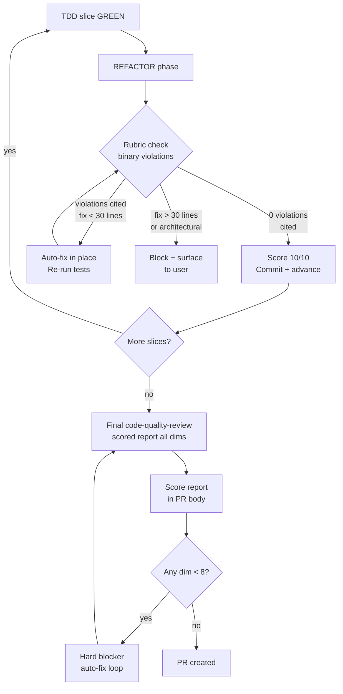

# Design: Quality Rubric Gate

## Canonical Vocabulary

| Term | Definition |
|------|-----------|
| Rubric | The four-dimension scoring framework (Quality, Readability, Encapsulation, Clarity), each 1–10 |
| Dimension | One of the four rubric axes; scores 10 when every item in it is satisfied |
| Gate | A hard stop in the TDD/review flow that blocks advancement until all dimensions reach target score |
| Auto-fix | The code-quality-review mode in which findings are applied directly without user approval |
| Review mode | The code-quality-review mode in which findings are presented as diffs for user approval |
| Slice | One vertical TDD unit (data → logic → UI → tests) from plan.md |
| Baseline Score | The rubric score for a file before this PR's changes; published in the PR report for comparison |
| Citation | A `filename:line` reference that must accompany every violation claim; absence invalidates the deduction |
| Violation Weight | The score deduction per cited violation; each criterion in `lib/code-quality-rubric.md` declares its own weight (minor = −1, major = −2, critical = −4) |
| Per-slice check | Lightweight rubric self-assessment run at each TDD REFACTOR phase; auto-fixes violations in place |
| Final review | The authoritative scored pass run by `code-quality-review` after all slices complete; produces the dimension × file score table |

## Decisions

### D1 — Augment, not replace
**Decision:** The new four-dimension rubric augments the existing `code-quality-review` criteria. Existing examples (file size, spaghetti, thin wrappers, types, canonical reuse) are remapped into the appropriate rubric dimensions rather than discarded.

**Rationale:** The rubric is the organizing framework; the existing criteria are concrete examples that fit naturally inside it. Keeping them preserves institutional knowledge while gaining the structured scoring vocabulary.

**Mapping:**
- File size (≥1000 lines) → Readability ("fits in one mental model")
- Spaghetti / ad-hoc conditionals → Quality ("no workarounds in wrong place", "no dead logic")
- Thin wrappers / abstraction violations → Encapsulation ("opaque internals")
- Types (unnecessary optionality, casts) → Quality / Clarity
- Canonical reuse → Clarity ("canonical vocabulary", "obvious data flow")

**Alternatives considered:** Replace outright — rejected because it discards concrete worked examples that help the model recognize violations.

### D2 — Rubric lives in lib/, referenced by @-include
**Decision:** Rubric content lives in `lib/code-quality-rubric.md`. Both `skills/code-quality-review.md` and `skills/tdd.md` `@`-include it.

**Rationale:** The rubric runs after every code gen — at each TDD slice's REFACTOR phase, not just the final review. Two skills need it; a shared lib doc avoids duplication and gives downstream repos a single file to override.

**Alternatives considered:** Embed in `code-quality-review.md` only — rejected because the REFACTOR phase in `tdd.md` also needs the rubric, and duplicating prose across skills creates drift.

### D3 — Rubric check is per-slice in REFACTOR, not just end-of-feature
**Decision:** The four-dimension rubric check runs at the REFACTOR step of every TDD slice, as well as at the final `code-quality-review` pass after all slices complete.

**Rationale:** User requirement — "runs after any code gen" to prevent structurally poor code accumulating slice by slice. Catching violations per-slice is cheaper than fixing them all at the end.

**Scope:** The per-slice check is a self-assessment against the rubric criteria; the final `code-quality-review` is the authoritative scored pass in auto-fix mode.

### D4 — Auto-fix in place; block only for large/architectural changes
**Decision:** Rubric violations found during REFACTOR are fixed immediately in-place. Tests re-run to confirm green before committing. Block and surface only when the fix would exceed ~30 lines or require architectural rethinking.

**Rationale:** Keeps the chain moving without per-slice interruptions while still catching structural problems early.

### D5 — Scored report shown after TDD, included in PR
**Decision:** After all TDD slices complete and all auto-fixes are applied, the final `code-quality-review` produces a scored report (dimension × file, 1–10 each) that is shown to the user before PR creation and included in the PR body.

**Rationale:** User requirement — visibility into scores at PR time, not just a pass/fail gate. The report surfaces any remaining 8–9 scores so the user can decide to accept or fix before merging.

### D6 — Scores derived from binary violation counting with mandatory citation
**Decision:** Every score is derived from an explicit count of PASS/FAIL violations. The model must cite `filename:line` for every deduction. No citation → no deduction. Score = 10 − Σ(violation weights). Weights are declared per criterion in `lib/code-quality-rubric.md`: minor violations (−1), major violations (−2), critical violations (−4). A score of "9" means exactly one minor violation cited.

**Rationale:** Prevents hallucinated quality scores. Subjective judgment ("this feels like a 7") is replaced by evidence-based accounting. Trivially machine-measurable items (file line count via `wc -l`) act as a sanity check.

**Gate:** 8+ on all four dimensions to ship. 10/10 is the target; the auto-fix loop aims for it. Any dimension below 8 is a hard blocker. Scores of 8–9 ship but appear visibly in the PR report.

**Future:** Further measurement enhancement (static analysis, AST-based checks) will be researched separately and can slot in by adding tool-assisted checks alongside the citation model.

### D7 — Scaffold dogfoods the rubric against its own source files
**Decision:** The rubric gates this PR's own changed files. Because the PR modifies `lib/code-quality-rubric.md`, `skills/code-quality-review.md`, and `skills/tdd.md`, the final review runs on those exact files — dogfooding is the normal gate, not a special step.

**Rationale:** Running the rubric on the files that define the rubric is the strongest validation. If the implementation produces plausible, auditable scores on its own source, it works. If it doesn't, we catch it before downstream repos see it.

## Edge Cases & Scenarios

- **Scenario:** A slice introduces a 300-line orchestrator file → Readability auto-deduction at REFACTOR; auto-fix extracts until under 250 lines or flags for user if extraction exceeds 30 lines.
- **Scenario:** A violation fix during REFACTOR breaks tests → revert the fix, surface to user with diagnosis rather than looping.
- **Scenario:** Final report shows one file scoring 7 on Encapsulation → hard blocker; auto-fix applies before PR is created.
- **Scenario:** React-specific criteria (useEffect deps) in code that is not React → skip those items; they produce no deduction for non-applicable contexts.

## Visualizations

## Q&A Summary

**Q:** Replace or augment existing criteria?
**A:** Augment — existing criteria (file size, spaghetti, thin wrappers, types, canonical reuse) map into the four dimensions.

**Q:** Where does the rubric live?
**A:** `lib/code-quality-rubric.md` — @-included by `skills/code-quality-review.md` and `skills/tdd.md`.

**Q:** When does the check run?
**A:** At every TDD slice REFACTOR phase, plus the final `code-quality-review` pass.

**Q:** Auto-fix or block?
**A:** Auto-fix in place for fixes <30 lines; block and surface for larger/architectural changes.

**Q:** Score visibility?
**A:** Scored report (dimension × file) shown after TDD, included in PR body.

**Q:** How to prevent hallucinated scores?
**A:** Binary violation counting with mandatory file:line citation. No citation → no deduction. Enhancement via static analysis deferred to future research.

