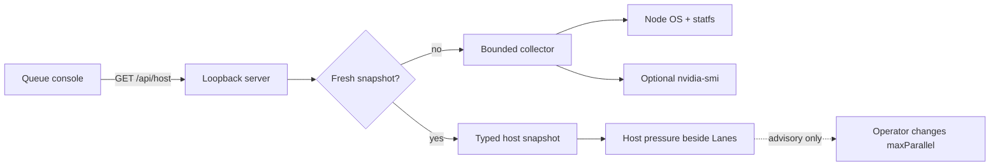

# Design: Queue Host Telemetry

## Canonical Vocabulary

| Term | Definition |
|---|---|
| Host snapshot | One bounded, read-only sample of CPU, memory, disk, and optional NVIDIA GPU state. |
| Resource guard | A `clear`, `warn`, or `blocked` comparison between current headroom and configured reserve/floor values. |
| Desired parallelism | The queue's existing `maxParallel` worker-lane setting. It is operator-controlled. |
| Worker-lane limit | An optional externally supplied ceiling for worker agents. It is distinct from host capacity and desired parallelism. |
| Unavailable metric | A metric the current platform or installed tools cannot report; it is displayed as unavailable, never synthesized as zero. |

## Decisions

### Advisory, never automatic

**Decision:** Show host pressure beside the existing Lanes control, including desired parallelism, active queue claims, and an optional worker-lane limit. Telemetry never changes queue configuration.

**Rationale:** Low resource use can justify another lane, but harness concurrency is an independent hard limit. Silent resizing could over-claim work or confuse a user who deliberately set the queue.

**Alternatives considered:** Automatically increase or reduce `maxParallel`; rejected because neither host measurements nor the queue can know every harness's concurrency contract.

### Cross-platform standard-library collector

**Decision:** Add a TypeScript collector using Node's `os` CPU/memory APIs and `fs.statfs` for the queue filesystem. CPU utilization is derived from two bounded `os.cpus()` samples so Windows does not depend on Unix load averages. NVIDIA data is optional and collected with a timed `nvidia-smi` invocation when present.

**Rationale:** These interfaces work on supported Node platforms without adding a package or assuming `free`, `df`, `du`, PowerShell, or procfs. An absent NVIDIA tool is normal on macOS and non-NVIDIA hosts.

**Alternatives considered:** Platform-specific shell commands; rejected because their output and availability differ. Recursive worktree-size scanning; rejected because an auto-refresh endpoint must not walk potentially huge trees.

### Bounded cached request path

**Decision:** `/api/host` serves a short-lived cached snapshot. Collection has explicit time bounds and converts unsupported metrics into typed unavailable values. Queue reads and writes do not await telemetry.

**Rationale:** Browser refreshes must not multiply subprocesses or delay the queue management surface.

### Configurable safety limits

**Decision:** Read optional environment configuration for memory reserve, disk free floor, GPU VRAM reserve, and worker-lane limit. Defaults are conservative and the response includes the effective values.

**Rationale:** Consumer repositories have materially different disk footprints and harness limits. A generic scaffold must expose configuration rather than encode VoidHorizon's numbers.

### Quiet accessible presentation

**Decision:** Render a semantic host-status list with text and symbols in addition to color. Auto-refresh does not use a live region.

**Rationale:** Resource samples update often and should be inspectable without repeatedly interrupting screen-reader users.

## Visualizations

## Edge Cases & Scenarios

- Windows host with no Unix load average: sampled CPU utilization remains available.
- macOS or non-NVIDIA host: GPU reads `unavailable`; CPU, memory, and disk still render.
- Hung `nvidia-smi`: the timeout expires, the GPU metric becomes unavailable, and queue endpoints continue serving.
- Disk or OS probe error: only that metric becomes unavailable; the endpoint still returns a typed snapshot.
- Resource guard is clear but the worker-lane limit is full: the panel says the host is clear and the harness is full.
- Four queue claims with only three worker slots: active claims and the configured worker limit are shown separately.

## Q&A Summary

**Q:** Should low resource usage automatically increase lane count?

**A:** No. Show enough evidence to make the choice quickly, while leaving the existing Lanes control operator-owned.

**Q:** Which resources matter for lane sizing?

**A:** CPU pressure, available memory, queue-filesystem free space, optional GPU/VRAM pressure, active claims, desired parallelism, and an optional worker-lane limit.
